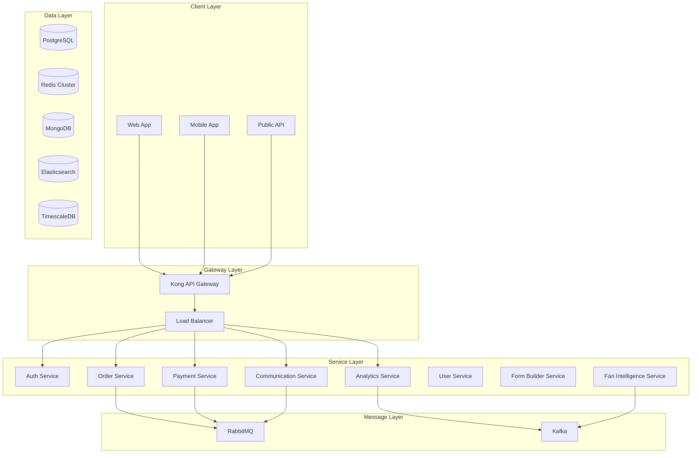
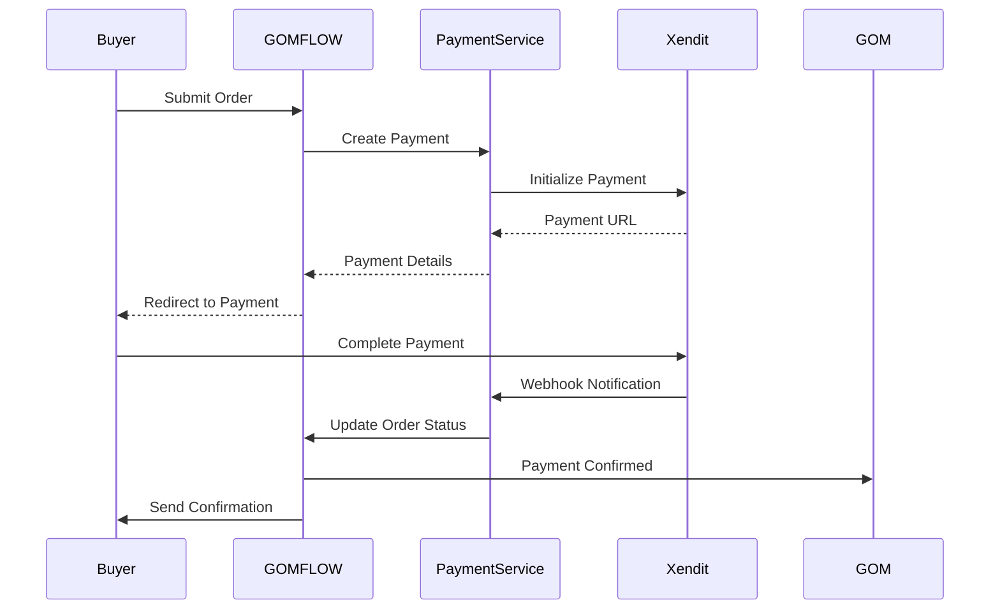

# GOMFLOW Technical Architecture & Implementation Guide

## Table of Contents
1. [System Overview](#system-overview)
2. [Architecture Principles](#architecture-principles)
3. [Technology Stack](#technology-stack)
4. [Microservices Architecture](#microservices-architecture)
5. [Payment Infrastructure](#payment-infrastructure)
6. [Messaging Infrastructure](#messaging-infrastructure)
7. [Data Architecture](#data-architecture)
8. [Security & Compliance](#security-compliance)
9. [Mobile Architecture](#mobile-architecture)
10. [DevOps & Deployment](#devops-deployment)
11. [Performance & Scaling](#performance-scaling)
12. [Development Roadmap](#development-roadmap)

## System Overview

GOMFLOW is a distributed, event-driven microservices platform designed to handle millions of group orders across Southeast Asia. The architecture prioritizes scalability, reliability, and regional payment method integration while maintaining sub-200ms response times for critical operations.

### Core Design Principles
- **Microservices First**: Each business domain is a separate service
- **Event-Driven**: Asynchronous communication via message queues
- **API Gateway Pattern**: Single entry point for all client requests
- **Database per Service**: Each service owns its data
- **Cloud-Native**: Kubernetes-based container orchestration
- **Regional Optimization**: Multi-region deployment for low latency

## Architecture Principles

### 1. Domain-Driven Design (DDD)
- **Order Management Domain**: Forms, orders, quotas
- **Payment Domain**: Transactions, reconciliation, refunds
- **Communication Domain**: Notifications, broadcasts
- **Analytics Domain**: Metrics, trends, insights
- **User Domain**: Authentication, profiles, permissions

### 2. CQRS Pattern
- **Command Side**: Write operations through event sourcing
- **Query Side**: Optimized read models in Redis/Elasticsearch
- **Event Store**: PostgreSQL with event replay capability

### 3. API Design Standards
- **RESTful APIs**: For CRUD operations
- **GraphQL**: For complex queries and mobile clients
- **WebSockets**: For real-time updates
- **gRPC**: For inter-service communication

## Technology Stack

### Core Platform
```yaml
Backend:
  Language: Node.js 20 LTS / TypeScript 5.x
  Framework: NestJS (microservices)
  API Gateway: Kong / Express Gateway
  Message Queue: RabbitMQ 3.12
  Cache: Redis 7.x Cluster
  Search: Elasticsearch 8.x

Frontend:
  Web: Next.js 14 / React 18
  Mobile: React Native / Expo
  State Management: Redux Toolkit / RTK Query
  UI Components: Tailwind CSS / shadcn/ui
  Real-time: Socket.io

Databases:
  Primary: PostgreSQL 16 (with partitioning)
  Document Store: MongoDB (for forms/templates)
  Time Series: TimescaleDB (for analytics)
  Cache: Redis Cluster
```

### Infrastructure
```yaml
Container Orchestration: Kubernetes 1.28
Service Mesh: Istio
API Gateway: Kong
Load Balancer: NGINX
CDN: Cloudflare
Monitoring: Prometheus + Grafana
Logging: ELK Stack (Elasticsearch, Logstash, Kibana)
Tracing: Jaeger
CI/CD: GitLab CI / GitHub Actions
```

## Microservices Architecture

### Service Map



### Service Definitions

#### 1. Auth Service
```typescript
// auth-service/src/main.ts
import { NestFactory } from '@nestjs/core';
import { MicroserviceOptions, Transport } from '@nestjs/microservices';

async function bootstrap() {
  const app = await NestFactory.createMicroservice<MicroserviceOptions>(
    AuthModule,
    {
      transport: Transport.RMQ,
      options: {
        urls: ['amqp://rabbitmq:5672'],
        queue: 'auth_queue',
        queueOptions: {
          durable: true,
        },
      },
    },
  );
  await app.listen();
}

// Features:
// - JWT token generation/validation
// - OAuth integration (Google, Facebook)
// - Phone number verification (Twilio)
// - Multi-factor authentication
// - Session management in Redis
```

#### 2. Order Service
```typescript
// order-service/src/entities/order.entity.ts
@Entity()
export class Order {
  @PrimaryGeneratedColumn('uuid')
  id: string;

  @Column()
  gomId: string;

  @Column({ type: 'jsonb' })
  items: OrderItem[];

  @Column({ type: 'decimal', precision: 10, scale: 2 })
  totalAmount: number;

  @Column({ type: 'enum', enum: OrderStatus })
  status: OrderStatus;

  @Column()
  quotaTarget: number;

  @Column()
  currentOrders: number;

  @Column({ type: 'timestamp' })
  deadline: Date;

  @CreateDateColumn()
  createdAt: Date;

  @UpdateDateColumn()
  updatedAt: Date;
}

// Features:
// - Order creation/management
// - Quota tracking
// - Automatic status updates
// - Deadline management
// - Bulk operations
```

#### 3. Payment Service
```typescript
// payment-service/src/payment.processor.ts
export class PaymentProcessor {
  private providers: Map<string, PaymentProvider>;

  constructor() {
    this.providers = new Map([
      ['xendit', new XenditProvider()],
      ['2c2p', new TwoCTwoPProvider()],
      ['stripe', new StripeProvider()],
    ]);
  }

  async processPayment(payment: PaymentRequest): Promise<PaymentResult> {
    const provider = this.providers.get(payment.provider);
    
    // Tokenize sensitive data
    const tokenizedData = await this.tokenizeCard(payment.cardData);
    
    // Process with provider
    const result = await provider.charge({
      ...payment,
      token: tokenizedData.token,
    });
    
    // Store audit trail
    await this.auditLog.record({
      transactionId: result.id,
      provider: payment.provider,
      amount: payment.amount,
      status: result.status,
    });
    
    return result;
  }
}
```

#### 4. Communication Service
```typescript
// communication-service/src/channels/whatsapp.channel.ts
export class WhatsAppChannel implements CommunicationChannel {
  private client: WhatsAppBusinessAPI;
  
  async sendBulkMessage(
    recipients: string[],
    template: MessageTemplate,
    variables: Record<string, any>
  ): Promise<BulkSendResult> {
    const chunks = chunk(recipients, 1000); // WhatsApp limit
    
    const results = await Promise.allSettled(
      chunks.map(chunk => 
        this.client.sendTemplate({
          to: chunk,
          template: template.id,
          variables,
        })
      )
    );
    
    return this.aggregateResults(results);
  }
}

// Supported channels:
// - WhatsApp Business API
// - Telegram Bot API
// - Discord Webhooks
// - SMS (Twilio)
// - Email (SendGrid)
```

## Payment Infrastructure

### Regional Payment Gateway Integration

```typescript
// payment-service/src/providers/xendit.provider.ts
export class XenditProvider implements PaymentProvider {
  private client: Xendit;
  
  constructor() {
    this.client = new Xendit({
      secretKey: process.env.XENDIT_SECRET_KEY,
    });
  }
  
  async createPayment(request: PaymentRequest): Promise<Payment> {
    // Support for multiple payment methods
    switch (request.method) {
      case 'EWALLET':
        return this.createEwalletCharge(request);
      case 'QR_CODE':
        return this.createQRPayment(request);
      case 'VIRTUAL_ACCOUNT':
        return this.createVirtualAccount(request);
      case 'CARD':
        return this.createCardPayment(request);
    }
  }
  
  private async createEwalletCharge(request: PaymentRequest) {
    const charge = await this.client.eWallet.createCharge({
      reference_id: request.orderId,
      amount: request.amount,
      currency: request.currency,
      channel_code: request.walletType, // GCASH, GRABPAY, PAYMAYA
      channel_properties: {
        success_redirect_url: `${BASE_URL}/payment/success`,
        failure_redirect_url: `${BASE_URL}/payment/failure`,
      },
    });
    
    return this.mapToPayment(charge);
  }
}
```

### Payment Security Architecture

```yaml
Security Layers:
  1. Network Security:
     - TLS 1.3 for all connections
     - IP whitelisting for payment webhooks
     - Rate limiting per merchant
  
  2. Data Security:
     - PCI DSS Level 2 compliance
     - Card data tokenization
     - AES-256 encryption at rest
     - Hardware Security Module (HSM) for keys
  
  3. Application Security:
     - Input validation and sanitization
     - SQL injection prevention
     - XSS protection
     - CSRF tokens
  
  4. Monitoring:
     - Real-time fraud detection
     - Anomaly detection with ML
     - Payment velocity checks
     - Geographic restrictions
```

### Payment Flow Diagram



## Messaging Infrastructure

### Multi-Channel Architecture

```typescript
// communication-service/src/orchestrator.ts
export class MessageOrchestrator {
  private channels: Map<ChannelType, MessageChannel>;
  private queue: Queue;
  
  async sendNotification(notification: Notification) {
    // Priority-based channel selection
    const channels = this.selectChannels(notification);
    
    // Queue messages for delivery
    for (const channel of channels) {
      await this.queue.add('send-message', {
        channel: channel.type,
        recipient: notification.recipient,
        content: notification.content,
        priority: notification.priority,
        retryPolicy: {
          attempts: 3,
          backoff: 'exponential',
        },
      });
    }
  }
  
  private selectChannels(notification: Notification): Channel[] {
    // Smart channel selection based on:
    // - User preferences
    // - Message urgency
    // - Channel availability
    // - Cost optimization
    return this.channelSelector.select(notification);
  }
}
```

### WhatsApp Business API Integration

```typescript
// communication-service/src/whatsapp/client.ts
export class WhatsAppClient {
  private baseUrl = 'https://api.whatsapp.com/v1';
  private webhookUrl = `${process.env.BASE_URL}/webhooks/whatsapp`;
  
  async setupWebhook() {
    await this.api.post('/settings/application', {
      webhooks: {
        url: this.webhookUrl,
        events: ['message_status', 'inbound_message'],
      },
    });
  }
  
  async sendTemplate(params: TemplateParams) {
    const payload = {
      to: params.phoneNumber,
      type: 'template',
      template: {
        namespace: process.env.WHATSAPP_NAMESPACE,
        name: params.templateName,
        language: {
          policy: 'deterministic',
          code: params.languageCode || 'en',
        },
        components: this.buildComponents(params.variables),
      },
    };
    
    return this.api.post('/messages', payload);
  }
}
```

### Telegram Bot Architecture

```typescript
// communication-service/src/telegram/bot.ts
export class TelegramBot {
  private bot: Telegraf;
  
  constructor() {
    this.bot = new Telegraf(process.env.TELEGRAM_BOT_TOKEN);
    this.setupCommands();
    this.setupWebhook();
  }
  
  private setupCommands() {
    this.bot.command('track', this.handleTrackOrder);
    this.bot.command('status', this.handleOrderStatus);
    this.bot.command('help', this.handleHelp);
    this.bot.on('text', this.handleMessage);
  }
  
  async broadcastToGroup(groupId: string, message: string) {
    await this.bot.telegram.sendMessage(groupId, message, {
      parse_mode: 'Markdown',
      reply_markup: {
        inline_keyboard: [[
          { text: 'View Order', url: `${BASE_URL}/order/${orderId}` },
          { text: 'Track Payment', callback_data: `track_${orderId}` },
        ]],
      },
    });
  }
}
```

## Data Architecture

### Database Schema Design

```sql
-- Orders table with partitioning
CREATE TABLE orders (
    id UUID DEFAULT gen_random_uuid(),
    gom_id UUID NOT NULL,
    form_id UUID NOT NULL,
    status VARCHAR(50) NOT NULL,
    total_amount DECIMAL(12, 2),
    currency VARCHAR(3),
    quota_target INTEGER,
    current_orders INTEGER DEFAULT 0,
    deadline TIMESTAMP WITH TIME ZONE,
    created_at TIMESTAMP WITH TIME ZONE DEFAULT NOW(),
    updated_at TIMESTAMP WITH TIME ZONE DEFAULT NOW(),
    metadata JSONB,
    PRIMARY KEY (id, created_at)
) PARTITION BY RANGE (created_at);

-- Create monthly partitions
CREATE TABLE orders_2024_01 PARTITION OF orders
    FOR VALUES FROM ('2024-01-01') TO ('2024-02-01');

-- Payments table with encryption
CREATE TABLE payments (
    id UUID DEFAULT gen_random_uuid() PRIMARY KEY,
    order_id UUID NOT NULL,
    buyer_id UUID NOT NULL,
    provider VARCHAR(50) NOT NULL,
    provider_reference VARCHAR(255),
    amount DECIMAL(12, 2) NOT NULL,
    currency VARCHAR(3) NOT NULL,
    status VARCHAR(50) NOT NULL,
    token_hash VARCHAR(64), -- Tokenized card data
    created_at TIMESTAMP WITH TIME ZONE DEFAULT NOW(),
    completed_at TIMESTAMP WITH TIME ZONE,
    metadata JSONB
);

-- Create indexes for performance
CREATE INDEX idx_orders_gom_id ON orders(gom_id);
CREATE INDEX idx_orders_status ON orders(status);
CREATE INDEX idx_payments_order_id ON payments(order_id);
CREATE INDEX idx_payments_status ON payments(status);
```

### Event Sourcing Implementation

```typescript
// shared/src/event-store/event-store.ts
export class EventStore {
  constructor(private db: Pool) {}
  
  async append(event: DomainEvent): Promise<void> {
    await this.db.query(`
      INSERT INTO events (
        aggregate_id,
        aggregate_type,
        event_type,
        event_data,
        event_metadata,
        event_version,
        created_at
      ) VALUES ($1, $2, $3, $4, $5, $6, NOW())
    `, [
      event.aggregateId,
      event.aggregateType,
      event.type,
      JSON.stringify(event.data),
      JSON.stringify(event.metadata),
      event.version,
    ]);
  }
  
  async getEvents(aggregateId: string): Promise<DomainEvent[]> {
    const result = await this.db.query(`
      SELECT * FROM events
      WHERE aggregate_id = $1
      ORDER BY event_version ASC
    `, [aggregateId]);
    
    return result.rows.map(this.mapToDomainEvent);
  }
}
```

### Redis Cache Strategy

```typescript
// shared/src/cache/cache-manager.ts
export class CacheManager {
  private redis: Redis.Cluster;
  
  constructor() {
    this.redis = new Redis.Cluster([
      { host: 'redis-1', port: 6379 },
      { host: 'redis-2', port: 6379 },
      { host: 'redis-3', port: 6379 },
    ]);
  }
  
  // Cache patterns
  async cacheOrder(order: Order): Promise<void> {
    const key = `order:${order.id}`;
    const ttl = 3600; // 1 hour
    
    await this.redis.setex(
      key,
      ttl,
      JSON.stringify(order)
    );
    
    // Also update sorted sets for queries
    await this.redis.zadd(
      `gom:${order.gomId}:orders`,
      Date.now(),
      order.id
    );
  }
  
  async getCachedOrder(orderId: string): Promise<Order | null> {
    const cached = await this.redis.get(`order:${orderId}`);
    return cached ? JSON.parse(cached) : null;
  }
  
  // Cache invalidation
  async invalidateOrder(orderId: string): Promise<void> {
    const order = await this.getCachedOrder(orderId);
    if (order) {
      await this.redis.del(`order:${orderId}`);
      await this.redis.zrem(
        `gom:${order.gomId}:orders`,
        orderId
      );
    }
  }
}
```

### Fan Intelligence Data Pipeline

```typescript
// analytics-service/src/pipeline/aggregator.ts
export class DataAggregator {
  private kafka: Kafka;
  private clickhouse: ClickHouse;
  
  async startPipeline() {
    const consumer = this.kafka.consumer({ groupId: 'analytics-group' });
    
    await consumer.subscribe({ 
      topics: ['orders', 'payments', 'user-events'],
      fromBeginning: false,
    });
    
    await consumer.run({
      eachMessage: async ({ topic, partition, message }) => {
        const event = JSON.parse(message.value.toString());
        
        // Real-time aggregation
        await this.aggregate(event);
        
        // Store in ClickHouse for analytics
        await this.clickhouse.insert({
          table: 'events',
          values: [{
            event_type: event.type,
            event_data: event.data,
            timestamp: new Date(event.timestamp),
          }],
        });
      },
    });
  }
  
  private async aggregate(event: Event) {
    switch (event.type) {
      case 'ORDER_CREATED':
        await this.updateTrendingProducts(event.data);
        await this.updateGeoData(event.data);
        break;
      case 'PAYMENT_COMPLETED':
        await this.updateRevenueMetrics(event.data);
        break;
    }
  }
}
```

## Security & Compliance

### PCI DSS Compliance Architecture

```yaml
PCI DSS Level 2 Requirements:

1. Network Security:
   - Network segmentation with VLANs
   - Firewall rules restricting payment zone
   - No direct internet access from payment services
   - Intrusion Detection System (IDS)

2. Access Control:
   - Role-Based Access Control (RBAC)
   - Multi-factor authentication for admin
   - Audit logging for all access
   - Principle of least privilege

3. Data Protection:
   - Card data tokenization at entry point
   - TLS 1.3 for data in transit
   - AES-256 encryption for data at rest
   - Secure key management with HSM

4. Monitoring:
   - Real-time security monitoring
   - Log aggregation and analysis
   - Vulnerability scanning
   - Penetration testing quarterly
```

### Tokenization Implementation

```typescript
// payment-service/src/tokenization/tokenizer.ts
export class PaymentTokenizer {
  private vault: TokenVault;
  private crypto: CryptoService;
  
  async tokenize(cardData: CardData): Promise<Token> {
    // Generate unique token
    const token = this.generateToken();
    
    // Encrypt card data
    const encryptedData = await this.crypto.encrypt(
      JSON.stringify(cardData),
      process.env.MASTER_KEY
    );
    
    // Store in secure vault
    await this.vault.store({
      token,
      encryptedData,
      createdAt: new Date(),
      expiresAt: this.calculateExpiry(),
    });
    
    // Return token for use
    return {
      token,
      last4: cardData.number.slice(-4),
      brand: this.detectCardBrand(cardData.number),
    };
  }
  
  async detokenize(token: string): Promise<CardData> {
    // Retrieve from vault
    const vaultEntry = await this.vault.retrieve(token);
    
    if (!vaultEntry || vaultEntry.expiresAt < new Date()) {
      throw new Error('Invalid or expired token');
    }
    
    // Decrypt and return
    const decrypted = await this.crypto.decrypt(
      vaultEntry.encryptedData,
      process.env.MASTER_KEY
    );
    
    return JSON.parse(decrypted);
  }
}
```

### API Security

```typescript
// api-gateway/src/middleware/security.middleware.ts
export class SecurityMiddleware {
  // Rate limiting
  rateLimiter = rateLimit({
    windowMs: 15 * 60 * 1000, // 15 minutes
    max: 100, // limit each IP to 100 requests per windowMs
    message: 'Too many requests from this IP',
    standardHeaders: true,
    legacyHeaders: false,
  });
  
  // Request signing for critical operations
  async verifyRequestSignature(req: Request): Promise<boolean> {
    const signature = req.headers['x-gomflow-signature'];
    const timestamp = req.headers['x-gomflow-timestamp'];
    
    // Prevent replay attacks
    if (Date.now() - parseInt(timestamp) > 300000) { // 5 minutes
      return false;
    }
    
    // Verify HMAC signature
    const payload = `${timestamp}.${JSON.stringify(req.body)}`;
    const expectedSignature = crypto
      .createHmac('sha256', process.env.WEBHOOK_SECRET)
      .update(payload)
      .digest('hex');
    
    return crypto.timingSafeEqual(
      Buffer.from(signature),
      Buffer.from(expectedSignature)
    );
  }
  
  // Input validation
  sanitizeInput(input: any): any {
    if (typeof input === 'string') {
      return validator.escape(input);
    }
    if (Array.isArray(input)) {
      return input.map(this.sanitizeInput);
    }
    if (typeof input === 'object' && input !== null) {
      const sanitized = {};
      for (const [key, value] of Object.entries(input)) {
        sanitized[key] = this.sanitizeInput(value);
      }
      return sanitized;
    }
    return input;
  }
}
```

## Mobile Architecture

### React Native Implementation

```typescript
// mobile/src/architecture/app.architecture.ts
export const AppArchitecture = {
  // State Management
  store: configureStore({
    reducer: {
      auth: authSlice.reducer,
      orders: ordersSlice.reducer,
      payments: paymentsSlice.reducer,
      notifications: notificationsSlice.reducer,
    },
    middleware: (getDefaultMiddleware) =>
      getDefaultMiddleware({
        serializableCheck: false,
      }).concat(
        offlineMiddleware,
        syncMiddleware,
        analyticsMiddleware
      ),
  }),
  
  // Offline Support
  offlineConfig: {
    effect: true,
    persist: true,
    persistOptions: {
      storage: AsyncStorage,
    },
    detectNetwork: (callback) => {
      NetInfo.addEventListener((state) => {
        callback(state.isConnected);
      });
    },
  },
  
  // API Layer
  apiClient: axios.create({
    baseURL: Config.API_URL,
    timeout: 30000,
    headers: {
      'Content-Type': 'application/json',
    },
  }),
};

// Biometric Authentication
export class BiometricAuth {
  async authenticate(): Promise<boolean> {
    const hasHardware = await LocalAuthentication.hasHardwareAsync();
    if (!hasHardware) return false;
    
    const result = await LocalAuthentication.authenticateAsync({
      promptMessage: 'Authenticate to access GOMFLOW',
      fallbackLabel: 'Use Passcode',
    });
    
    return result.success;
  }
}
```

### Push Notifications

```typescript
// mobile/src/notifications/push-manager.ts
export class PushNotificationManager {
  async initialize() {
    // Request permissions
    const { status } = await Notifications.requestPermissionsAsync();
    if (status !== 'granted') return;
    
    // Get push token
    const token = await Notifications.getExpoPushTokenAsync();
    await this.registerToken(token.data);
    
    // Handle notifications
    Notifications.addNotificationReceivedListener(this.handleNotification);
    Notifications.addNotificationResponseReceivedListener(
      this.handleNotificationResponse
    );
  }
  
  private handleNotification = (notification: Notification) => {
    // Handle based on notification type
    const { type, data } = notification.request.content.data;
    
    switch (type) {
      case 'payment_received':
        this.showPaymentAlert(data);
        break;
      case 'order_update':
        this.updateOrderStatus(data);
        break;
      case 'deadline_reminder':
        this.showDeadlineReminder(data);
        break;
    }
  };
}
```

## DevOps & Deployment

### Kubernetes Configuration

```yaml
# k8s/services/order-service/deployment.yaml
apiVersion: apps/v1
kind: Deployment
metadata:
  name: order-service
  namespace: gomflow
spec:
  replicas: 3
  selector:
    matchLabels:
      app: order-service
  template:
    metadata:
      labels:
        app: order-service
    spec:
      containers:
      - name: order-service
        image: gomflow/order-service:v1.0.0
        ports:
        - containerPort: 3000
        env:
        - name: NODE_ENV
          value: "production"
        - name: DATABASE_URL
          valueFrom:
            secretKeyRef:
              name: database-secret
              key: url
        - name: REDIS_URL
          valueFrom:
            configMapKeyRef:
              name: redis-config
              key: url
        resources:
          requests:
            memory: "256Mi"
            cpu: "250m"
          limits:
            memory: "512Mi"
            cpu: "500m"
        livenessProbe:
          httpGet:
            path: /health
            port: 3000
          initialDelaySeconds: 30
          periodSeconds: 10
        readinessProbe:
          httpGet:
            path: /ready
            port: 3000
          initialDelaySeconds: 5
          periodSeconds: 5
---
apiVersion: v1
kind: Service
metadata:
  name: order-service
  namespace: gomflow
spec:
  selector:
    app: order-service
  ports:
  - protocol: TCP
    port: 80
    targetPort: 3000
  type: ClusterIP
---
apiVersion: autoscaling/v2
kind: HorizontalPodAutoscaler
metadata:
  name: order-service-hpa
  namespace: gomflow
spec:
  scaleTargetRef:
    apiVersion: apps/v1
    kind: Deployment
    name: order-service
  minReplicas: 3
  maxReplicas: 20
  metrics:
  - type: Resource
    resource:
      name: cpu
      target:
        type: Utilization
        averageUtilization: 70
  - type: Resource
    resource:
      name: memory
      target:
        type: Utilization
        averageUtilization: 80
```

### CI/CD Pipeline

```yaml
# .gitlab-ci.yml
stages:
  - test
  - build
  - deploy

variables:
  DOCKER_REGISTRY: registry.gomflow.com
  KUBERNETES_NAMESPACE: gomflow

# Test stage
test:unit:
  stage: test
  script:
    - npm ci
    - npm run test:unit
  coverage: '/Coverage: \d+\.\d+%/'

test:integration:
  stage: test
  services:
    - postgres:16
    - redis:7
    - rabbitmq:3.12
  script:
    - npm ci
    - npm run test:integration

test:security:
  stage: test
  script:
    - npm audit
    - npm run security:scan
    - trivy image --exit-code 1 $IMAGE_NAME

# Build stage
build:services:
  stage: build
  script:
    - docker build -t $DOCKER_REGISTRY/$SERVICE_NAME:$CI_COMMIT_SHA .
    - docker push $DOCKER_REGISTRY/$SERVICE_NAME:$CI_COMMIT_SHA
  parallel:
    matrix:
      - SERVICE_NAME: [auth-service, order-service, payment-service, communication-service]

# Deploy stage
deploy:staging:
  stage: deploy
  environment: staging
  script:
    - kubectl set image deployment/$SERVICE_NAME $SERVICE_NAME=$DOCKER_REGISTRY/$SERVICE_NAME:$CI_COMMIT_SHA -n $KUBERNETES_NAMESPACE
    - kubectl rollout status deployment/$SERVICE_NAME -n $KUBERNETES_NAMESPACE
  only:
    - develop

deploy:production:
  stage: deploy
  environment: production
  script:
    - helm upgrade --install gomflow ./helm-charts/gomflow \
        --set image.tag=$CI_COMMIT_SHA \
        --namespace $KUBERNETES_NAMESPACE \
        --wait
  only:
    - main
  when: manual
```

### Monitoring Stack

```yaml
# monitoring/prometheus/prometheus.yaml
global:
  scrape_interval: 15s
  evaluation_interval: 15s

scrape_configs:
  - job_name: 'kubernetes-pods'
    kubernetes_sd_configs:
      - role: pod
    relabel_configs:
      - source_labels: [__meta_kubernetes_pod_annotation_prometheus_io_scrape]
        action: keep
        regex: true
      - source_labels: [__meta_kubernetes_pod_annotation_prometheus_io_path]
        action: replace
        target_label: __metrics_path__
        regex: (.+)

  - job_name: 'node-exporter'
    static_configs:
      - targets: ['node-exporter:9100']

alerting:
  alertmanagers:
    - static_configs:
        - targets: ['alertmanager:9093']

rule_files:
  - '/etc/prometheus/rules/*.yml'

# Alert rules
groups:
  - name: gomflow_alerts
    rules:
      - alert: HighErrorRate
        expr: rate(http_requests_total{status=~"5.."}[5m]) > 0.05
        for: 5m
        labels:
          severity: critical
        annotations:
          summary: "High error rate detected"
          description: "Error rate is above 5% for {{ $labels.service }}"
      
      - alert: PaymentServiceDown
        expr: up{job="payment-service"} == 0
        for: 1m
        labels:
          severity: critical
        annotations:
          summary: "Payment service is down"
          description: "Payment service has been down for more than 1 minute"
```

## Performance & Scaling

### Performance Optimization Strategies

```typescript
// shared/src/performance/optimizations.ts

// 1. Database Query Optimization
export class QueryOptimizer {
  // Use prepared statements
  private statements = new Map<string, PreparedStatement>();
  
  async getOrdersOptimized(gomId: string, limit: number) {
    const query = `
      SELECT o.*, 
             COUNT(p.id) as payment_count,
             SUM(p.amount) as total_paid
      FROM orders o
      LEFT JOIN payments p ON o.id = p.order_id
      WHERE o.gom_id = $1
        AND o.created_at > NOW() - INTERVAL '30 days'
      GROUP BY o.id
      ORDER BY o.created_at DESC
      LIMIT $2
    `;
    
    return this.db.query(query, [gomId, limit]);
  }
  
  // 2. Batch operations
  async batchInsertOrders(orders: Order[]) {
    const values = orders.map((o, i) => 
      `($${i*5+1}, $${i*5+2}, $${i*5+3}, $${i*5+4}, $${i*5+5})`
    ).join(',');
    
    const params = orders.flatMap(o => [
      o.gomId, o.formId, o.totalAmount, o.status, o.deadline
    ]);
    
    await this.db.query(`
      INSERT INTO orders (gom_id, form_id, total_amount, status, deadline)
      VALUES ${values}
      ON CONFLICT (id) DO NOTHING
    `, params);
  }
}

// 3. Caching Strategy
export class CacheStrategy {
  // Multi-level caching
  async getWithCache<T>(
    key: string,
    fetcher: () => Promise<T>,
    options: CacheOptions = {}
  ): Promise<T> {
    // L1: In-memory cache (LRU)
    const memCached = this.memCache.get(key);
    if (memCached) return memCached;
    
    // L2: Redis cache
    const redisCached = await this.redis.get(key);
    if (redisCached) {
      const parsed = JSON.parse(redisCached);
      this.memCache.set(key, parsed);
      return parsed;
    }
    
    // L3: Fetch from source
    const data = await fetcher();
    
    // Update caches
    await this.redis.setex(
      key,
      options.ttl || 3600,
      JSON.stringify(data)
    );
    this.memCache.set(key, data);
    
    return data;
  }
}

// 4. Connection Pooling
export const dbPool = new Pool({
  host: process.env.DB_HOST,
  port: parseInt(process.env.DB_PORT || '5432'),
  database: process.env.DB_NAME,
  user: process.env.DB_USER,
  password: process.env.DB_PASSWORD,
  max: 20, // Maximum connections
  idleTimeoutMillis: 30000,
  connectionTimeoutMillis: 2000,
  statement_timeout: 30000,
  query_timeout: 30000,
});
```

### Scaling Architecture

```yaml
# Regional deployment for low latency
Regions:
  singapore:
    - Primary region for SEA
    - PostgreSQL master
    - Redis cluster primary
    - Full service deployment
  
  jakarta:
    - Read replica for Indonesia
    - Redis cluster replica
    - Edge caching with Cloudflare
  
  manila:
    - Read replica for Philippines
    - Redis cluster replica
    - Edge caching
  
  bangkok:
    - Read replica for Thailand
    - Redis cluster replica
    - Edge caching

Database Scaling:
  - PostgreSQL with read replicas
  - Connection pooling with PgBouncer
  - Query result caching in Redis
  - Partitioning for large tables

Application Scaling:
  - Horizontal pod autoscaling
  - Cluster autoscaling for nodes
  - Service mesh for load balancing
  - Circuit breakers for resilience
```

## Development Roadmap

### Phase 1: MVP (Months 1-3)
```yaml
Core Features:
  - Basic order form builder
  - Payment integration (Xendit only)
  - WhatsApp notifications
  - Simple dashboard
  - Authentication system

Technical Milestones:
  - Kubernetes cluster setup
  - CI/CD pipeline
  - Basic monitoring
  - Security baseline
  - Database schema v1
```

### Phase 2: Production Launch (Months 4-6)
```yaml
Enhanced Features:
  - Multi-payment provider support
  - Telegram and Discord integration
  - Advanced analytics
  - Mobile app beta
  - API v1 release

Technical Milestones:
  - Multi-region deployment
  - Advanced monitoring and alerting
  - Performance optimization
  - Security hardening
  - Load testing (10k concurrent users)
```

### Phase 3: Scale & Intelligence (Months 7-9)
```yaml
Intelligence Features:
  - Fan Intelligence platform
  - Trending algorithm
  - Demand forecasting
  - Price optimization
  - B2B API

Technical Milestones:
  - Real-time data pipeline
  - Machine learning infrastructure
  - Advanced caching strategies
  - GraphQL API
  - 99.9% uptime SLA
```

### Phase 4: Regional Expansion (Months 10-12)
```yaml
Expansion Features:
  - 5-country presence
  - Multi-language support
  - Local payment methods
  - Regional customization
  - Enterprise features

Technical Milestones:
  - Global CDN deployment
  - Advanced disaster recovery
  - Compliance certifications
  - API v2 with GraphQL
  - White-label architecture
```

## Conclusion

This technical architecture provides a robust, scalable foundation for GOMFLOW to revolutionize group order management across Southeast Asia. The microservices architecture ensures flexibility and scalability, while the focus on security and compliance builds trust with both GOMs and buyers.

Key architectural decisions:
1. **Microservices with event-driven communication** for scalability
2. **Multi-region deployment** for low latency across SEA
3. **Comprehensive payment security** with PCI DSS compliance
4. **Real-time messaging** across multiple channels
5. **Advanced caching and optimization** for performance
6. **Cloud-native deployment** with Kubernetes for reliability

The architecture is designed to handle millions of transactions while maintaining sub-200ms response times, ensuring GOMFLOW can scale from 1,000 to 100,000+ GOMs without major architectural changes.